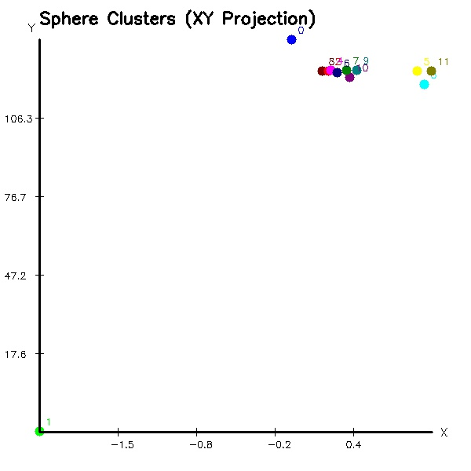

## Erik Valle
Connect with me on 🏢 [LinkedIn](https://www.linkedin.com/in/erik-v-499345141/)

## Technical test Elekta

Your task is to write a C++ program that loads a point cloud from a given .pcd file, detects all spheres within the cloud, and groups them into N clusters based on their spatial distance. You may use computer vision libraries as needed. This task is to be completed independently.

## Dependencies
- C++17
- Point Cloud Library (PCL)
- OpenCV

## Directory Structure
```bash
/test
├── build
│   ├── clusters.jpg
│   ├── CMakeCache.txt
│   ├── CMakeFiles
│   ├── cmake_install.cmake
│   ├── Makefile
│   └── sphere_clustering
├── CMakeLists.txt
├── data.pcd
├── Dockerfile
├── README.md
└── src
    └── main.cpp
```

## Analysis
Given the multiple solutions we can use for this test (K-Means + PCA, DBSCAN, NCC, etc.), I chose spectral clustering because it requires computing a similarity matrix based on Gaussian similarities between points. 

## Usage
1. Install the following libraries in your local host

```bash
apt-get install libpcl-dev libopencv-dev
```
2. Compile the code locally
```bash
cd build
cmake ..
make
```
3. Add your PCD file and run it
```bash
./sphere_clustering ../data.pcd
```
4. Visualize the results
```bash
Loaded point cloud with 28996 points.
Detected sphere: center=(0.4634, -0.218064, -0.286602), radius=1.11089
Detected sphere: center=(0.185049, -0.112298, 0.914762), radius=1.45937
Detected sphere: center=(0.236574, -0.103863, -0.205486), radius=0.747698
Detected sphere: center=(0.254975, -0.175228, -0.356565), radius=1.1085
Detected sphere: center=(0.411817, 2.23042, -0.10159), radius=2.76899
Detected sphere: center=(0.385205, -0.348991, -0.319252), radius=1.41219
Detected sphere: center=(0.953189, 0.0379379, 0.452993), radius=0.989745
Detected sphere: center=(-2.10032, 135.885, 12.2884), radius=136
Detected sphere: center=(0.308555, 0.515483, 0.339631), radius=1.46059
Detected sphere: center=(1.0148, 5.04497, 4.46587), radius=6.60334
Detected sphere: center=(-0.0586371, -11.9677, 24.9975), radius=27.2905
Detected sphere: center=(1.07199, -0.132364, -0.224888), radius=1.36679
Estimated number of clusters: 12
```

<div>

</div>

## Docker
If you wan to build the code in a Docker image and run it, please follow the next steps: 

```bash
docker build -t sphere_clustering .
docker run --rm -v $(pwd):/app sphere_clustering
```